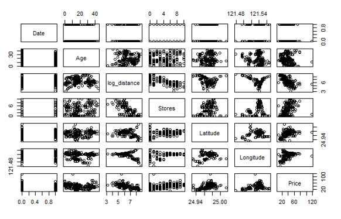
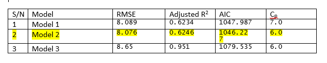
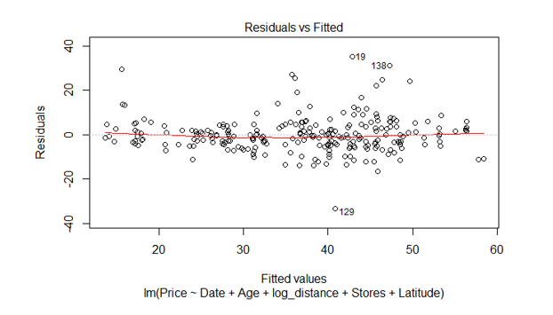
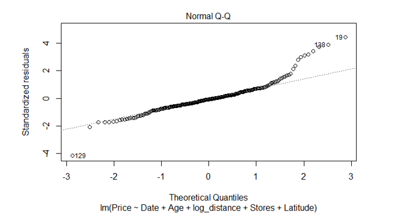
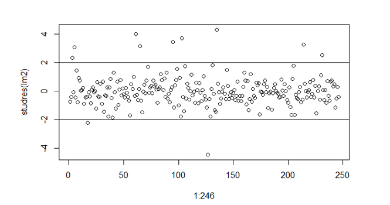
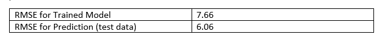

# Multiple- Regression Model to Predict the House Prices of New-Taipei City, Taiwan
## Abimbola Ogungbire (University of North Carolina at Greensboro)

### Introduction

A Multiple Regression Model is developed to predict house prices in New Taipei City, Taiwan. This method is considered one of the most abused methods in statistical analysis but this report discuss in detail findings from the data exploration and adequate techniques used to develop the model. Model assessment and validation are also crucial part of my analysis.

### Understanding the Data

The dataset has been split into train and test data. Exploring the train data reveals that the train data has 250 observations and 7 attributes. 
The relationship between variables are as shown in the pairwise scatter plot in Fig.1 below. Inspection of the scatter plot suggest there may be need for transformation of variable “Distance”. The plots in the 7th row shows the relationship between the response variable “Price” and all other variables in the data frame. There is an unsual response value- observation 72 has a Price value of 117.5. There is no sign of multi-collinearity among explanatory variables.
 
 
 
 
###  Methods

While developing a multiple regression model I treated the date variable as a categorical variable. The date was encoded in 0s ad 1s as dates of houses purchased in year 2013 and 2012 respectively. 

#### Model selection

A model was developed using all variables and the estimated coefficients were all statistically significant following the p values of corresponding variables. The tested model is given below:

Model_1 =α+ β_1*Date+ β_2*Stores+ β_3*log_distance⁡〖+ β_4 〗*latitude+ β_5*Age+ β_6*Longitude

By using the backward stepwise regression method, the recommended model is given as:

Model_2 =α+ β_1*Date+ β_2*Stores+ β_3*log_distance⁡〖+ β_4 〗*latitude+ β_5*Age

I’ll go ahead and fit a model with a no intercept to see how much variability in the price is being explained by the explanatory variable.

Model_3=β_1*Date+ β_2*Stores+ β_3*log_distance⁡〖+ β_4 〗*latitude+ β_5*Age

The result of the models in term of R2 RMSE and AIC is given in the table below:

 

The result above shows that Model 2 is a better model with the Cp = p and smallest AIC. 
We will proceed by checking the residual plot of Model 2 as shown in Fig. 2 below. From the residual plot, we cannot ascertain the equal variance assumption, the point are not all scattered around the zero line. The residual plot also shows unusual points in the data, we will check this point if they are indeed extreme. Fig. 3 shows the normal Q-Q plot, the points however does not fall completely on the line. 
We will remove the unusual points and re-fit the model.
Re-fitting the model didn’t influence the result much. We will keep the model and move on to assessment of the model and using case influence statistics:

 
 
  
 
Cook’s distance: A total number of 3 points were raised as influential from the cook’s distance and they will be further inspected.
Studentized residual shows that less than 5% of the data lie outside the +2 and -2 range. The model is satisfactory in this regards.
 
  

#### Prediction

The model will therefore be used to make predictions using the test data. The RMSE for the model using training data is given as 7.66. 
The test data after being visualized has no much noise and will hereby be used to make prediction using the model developed above. i.e Model_2.
The RMSE for the test data is given as 6.06. We can hereby conclude that he model is a good model for prediction since the RMSE for train data given as 7.66 is quite similar to the RMSE of the test data.
RMSE for Trained Model	7.66
RMSE for Prediction (test data)	6.06

 

#### Conclusion

We can conclude that the model is a good model following the closely similar RMSE in the table above. The smaller RMSE for test data is as a result of the little noise in the test data unlike the train data with so much noise. 
